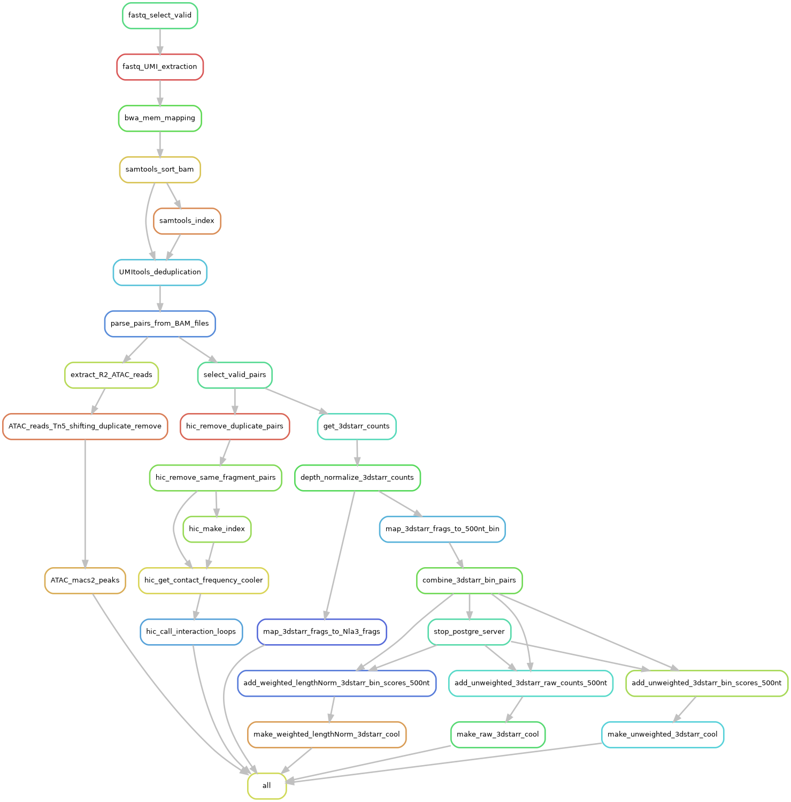

# The 3DSTARRseq Preprocessing Workflow
--------------------------------------
### Overview
The 3DSTARRseq assay was designed to capture the functional readout of cREs in the context of their cell-type-specific 3D-interaction. It's a fusion of the [HiCAR assay](https://www.sciencedirect.com/science/article/pii/S1097276522000983) and the classic [STARRseq assay](https://www.science.org/doi/10.1126/science.1232542).

This pipeline pre-processes raw fastq files to bin pairs and weighted (or unweighted) 3DSTARRseq counts in hdf5 file format. This file can then be further analyzed using the 3DSTARRsuite package.

### Work flow diagram of the pipeline


### Dependencies 
The following packages are directly used in this pipeline:
* python version 3.11.9
* [snakemake](https://snakemake.readthedocs.io/en/stable/) (workflow management) 8.16.0
* [cutadaptor](https://cutadapt.readthedocs.io/en/stable/) 4.9
* [bedtools](https://bedtools.readthedocs.io/en/latest/index.html) 2.31.1
* [BWA](http://bio-bwa.sourceforge.net)  0.7.18
* [samtools](http://www.htslib.org/download/) 1.20
* [pairstool](https://pairtools.readthedocs.io/en/latest/installation.html)  1.1.0
* [pairix](https://github.com/4dn-dcic/pairix#installation-for-pairix) 0.3.8
* [postgresql](https://www.postgresql.org/docs/16/release-16-4.html) 16.4
* [cooler](https://github.com/open2c/cooler) 0.10.2
* [macs2](https://github.com/macs3-project/MACS) 2.2.9.1
* [umi_tools](https://umi-tools.readthedocs.io/en/latest/faq.html) 1.1.5
* [moustache](https://github.com/ay-lab/mustache) 1.0.1

These packages (those that aren't included in this repository) can be installed via conda using the environment.yml file present herein. Please install and run this pipeline using the step-by-step intructions below.

### Installation and preparation for running
1. Ensure conda is installed on your linux machine (miniconda3 can be installed by following [these instructions](https://docs.conda.io/projects/conda/en/latest/user-guide/install/linux.html)) and initialized (by running `conda init`).

2. Install `git` which will be used to clone the pipeline repository. Git can be installed by running:
`conda install conda-forge::git`
After git is installed, use git to clone the 3d-starrseq-pipeline repository and navigate into the cloned directory by running the following:
```
git clone https://github.com/Arinze-BioX/3d-starrseq-pipeline.git
cd 3d-starrseq-pipeline
```

3. Within the repository directory is an `environment.yml` file. Install the packages in the yml file into a new conda envrironment by running the code below. 
```
conda env create -n 3dstarrseq --file environment.yml
conda activate 3dstarrseq
```

4. Make the index of your genome of interest by running: `bwa index -p [reference_genome_fasta_file]`. Various reference genome fasta files can be downloaded from [UCSC](https://hgdownload.soe.ucsc.edu/downloads.html) using `wget [link_to_reference_genome_fasta_file]` if wget is your referred downloader (an alternative is `curl`).

5. Add the necessary data files needed for this pipeleine into the `./data/` subfolder. Data files include Mse1-digested genome fragments file, Nla3-digested genome fragment file, and the binned genome file (using 500nt as the default bin size, but this can be changed). The restriction enzyme-digested genome fragments file (for Mse1 and Nla3) can be created by cooler via
```
cooler digest -o output_[enzyme].bed CHROMSIZES_PATH FASTA_PATH ENZYME
```
Recall that the FASTA and CHROMSIZES files needed to run the above code will be in the directory of your created bwa index. The binned genome bed file can also be created separately or downloaded.

### Running the pipeline
1. Edit the `config_file.yaml` within the 3d-starrseq-pipeline directory by adding the correct paths to all the needed files. Other parameters such as the reference genome (e.g. hg38, mm10) and the resolution/bin size for the hic interaction matrix, can also be edited.
2. Also edit the `myprofile/config.yaml` file by inputing the needed details for the distributed execution of the pipeline on a hpc platform according to the specifications detailed here.
3. Edit the `samples.json` file by entering the sample name and paths to the sample fastq files. Please see an exaple of the json formatted sample details below. 
```
{
    "sample1": {
        "R1": [
            "fastq/sample1_L001_R1_001.fq.gz"
        ],
        "R2": [
            "fastq/sample1_L001_R2_001.fq.gz"
        ]
    }
}
```
4. Edit the `run_snake.sh` file by replacing lines 3 and 4 with the following 2 lines of code:
```
source [path/to/your/miniconda/etc/profile.d/conda.sh]
conda activate [your_3dstarrseq_conda_environment]
```
5. Now, start the pipeline by running `./run_snake.sh`.

### Output files: 
This pipeline produces 3 main groups of outputs:
- HiC-type interaction frequency matrix (in .cool format).
- The chromatin accessibility (atacseq) component of the HiCAR data.
- The bin-pair counts for further downstream analyses specific to the 3dstarrseq functional assay.

#### 1. [interaction frquency pairs](https://pairtools.readthedocs.io/en/latest/formats.html) containing a list of valid contacts.
```
Columns: 
=======
1) Read Name 
2) chr1
3) pos1
4) chr2
5) pos2
6) strand1
7) strand1
```
#### 2. [cooler](https://cooler.readthedocs.io/en/latest/datamodel.html), genomically-labeled sparse 2D matrices, which can be viewed by [HiGlass](https://docs.higlass.io). The chromatin interaction loops called from this file using [moustache](https://github.com/ay-lab/mustache) are also among the outputs.

#### 3. ATAC peaks called by macs2.

#### 4. 3dstarrseq counts also in the same format as the cool file (hdf5 formatted).

The 3dstarrseq counts file produced (with ".cool" extension) will then be used as input into the 3dstarrsuite package for more downstream 3dstarrseq-specific analyses.

Other intermediate files and metrics are also produced for the user to explore.

For any questions regarding this pipeline or the 3dstarrseq assay, please send an email to Arinze Okafor (arinze.okafor@duke.edu)